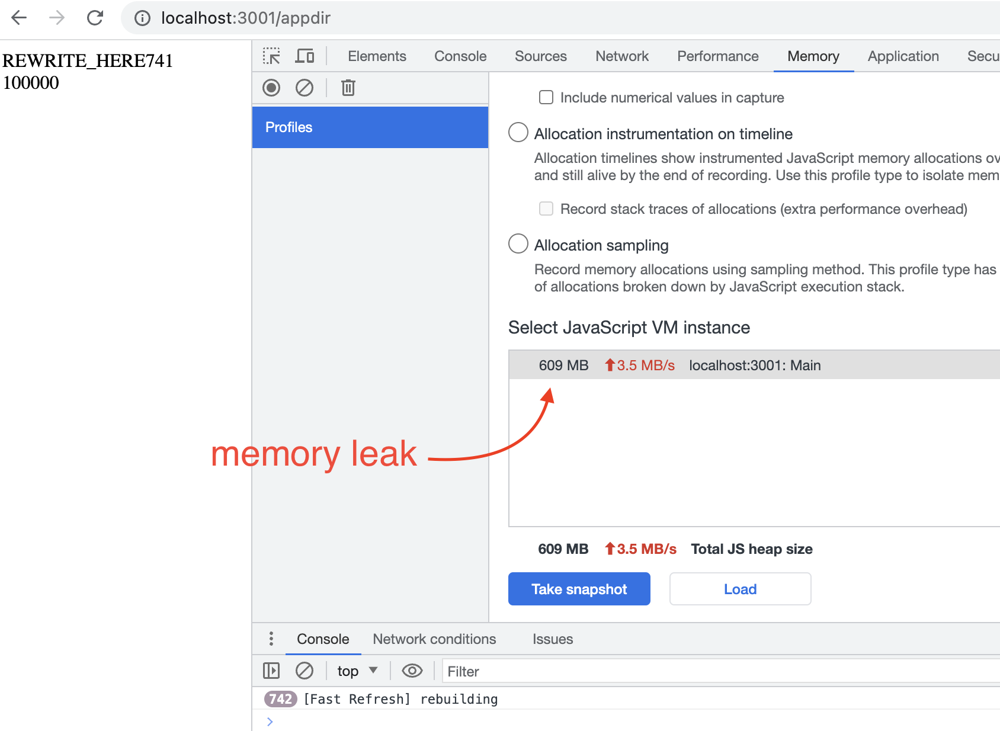

# fast-refresh-hmr-memory-leak-demo

**Note: This kind of memory leak is usually not critical. Most likely, only when loading a huge payload in the module, memory leak issue will be visible for devs.**

React Fast Refresh / HMR is really useful while iterating on React UIs.
Each bundler is using different strategy to implement React Fast Refresh.
This repo is to play with their behavior.

Notably, Vite is using ESM to reexecute the same file by loading the same file using different URL (e.g. appending something like `?t=1234456`) since we cannot load different file under the same URL.
Because of this, if Vite does not change its way to load updated module, memory leak will always happen since previously loaded exports needed to be retained in the memory to prepare for subsequent load for the same URL.

In the following React code, `App` is exported and it's enclosing `DATA` as a closure, which means as long as `App` function exists, `DATA` will never purged.

```tsx
const DATA = Array.from({ length: 100000 }, (_, i) => Math.random());

export const App = () => {
  return (
    <div>
      <div>REWRITE_HERE</div>
      <div>{DATA.length}</div>
    </div>
  );
};
```

When not using ES Modules for updated code loading, technically it should be possible to avoid retaining previous versions of `App` forever.
However, I just found that the following tools have the memory leak issue and tried to fix them:

- `@pmmmwh/react-refresh-webpack-plugin@0.5.10` had a memory leak
  - PR: https://github.com/pmmmwh/react-refresh-webpack-plugin/pull/766
    - :tada: This is merged and `@pmmmwh/react-refresh-webpack-plugin@0.5.11` does not have a memory leak
- `next@13.5.1` has a memory leak
  - PR: https://github.com/vercel/next.js/pull/53797
    - :tada: This is merged and `next@13.5.3-canary.1` does not have a memory leak


## How to play with memory leaks reproduction in this repo

After installing packages via `npm ci`, you can run either of `npm run vite`, `npm run webpack`, or `npm run next`.
Then open the page using Google Chrome for memory inspection and run `npm run rewrite` in another terminal, which will update source files 1000 times in 100ms intervals.
And you can watch the memory usage will increase to around several hundreds megabytes.


